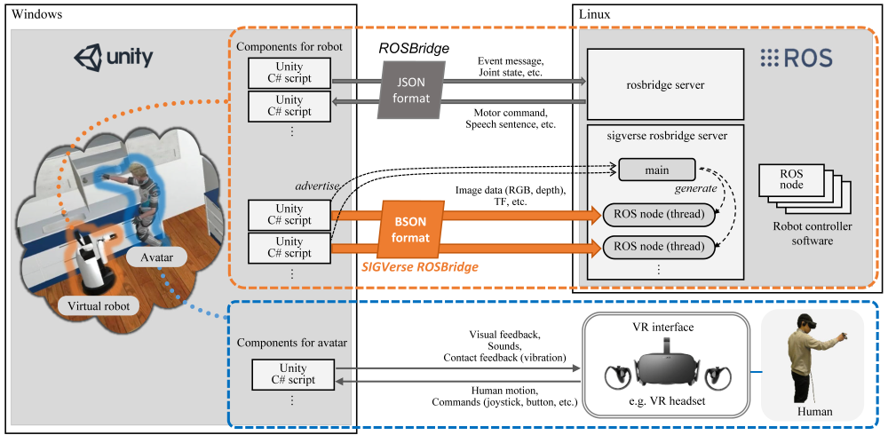

Welcome! :bowtie:

This organization is for the RoboCup@Home Simulation competition.

# Rule Book

Please refer to the following page.  
https://sites.google.com/view/robocup-athome-sim/

# System Overview

The robot simulation in a virtual world is built with Unity and ROS 2.  
Depending on the task, a human can enter the virtual world using a VR device.

This system requires a Windows computer to run SIGVerse as well as an Ubuntu computer to run ROS 2 nodes created by the participants.  
Connect the two computers using a wired Ethernet switch.

Please see [the official SIGVerse website] for information about SIGVerse.

For details on setting up the environment, please refer to the [environment](Environment.md) page.

[the official SIGVerse website]:https://github.com/SIGVerse/sigverse_unity_project/wiki "SIGVerse"

# Repositories

Name                                  | Description    
------------------------------------- |----------------
[handyman-unity2][Handyman]           | Handyman task Unity project   
[interactive-cleanup-unity2][Cleanup] | Interactive Cleanup task Unity project
[human-navigation-unity2][HumanNav]   | Human Navigation task Unity project
[common-unity2][UnityCmn]             | Unity project common to all competition tasks
[ros2-competition-msgs][ROS2Cmn]      | ROS 2 interfaces and examples for all competition tasks
[console-simple-tts][TTS]             | C# app for Text-to-Speech

[Handyman]: https://github.com/RoboCupatHomeSim/handyman-unity2
[Cleanup]: https://github.com/RoboCupatHomeSim/interactive-cleanup-unity2
[HumanNav]: https://github.com/RoboCupatHomeSim/human-navigation-unity2
[UnityCmn]: https://github.com/RoboCupatHomeSim/common-unity2
[ROS2Cmn]: https://github.com/RoboCupatHomeSim/ros2-competition-msgs
[TTS]: https://github.com/RoboCupatHomeSim/console-simple-tts

# Tasks

Please refer to the repository for each task.

Handyman  
https://github.com/RoboCupatHomeSim/handyman-unity2/

Interactive Cleanup  
https://github.com/RoboCupatHomeSim/interactive-cleanup-unity2/

Human Navigation  
https://github.com/RoboCupatHomeSim/human-navigation-unity2/

# Specification of the virtual HSR

Please see this file [Virtual_HSR_spec.pdf](Virtual_HSR_spec.pdf)
